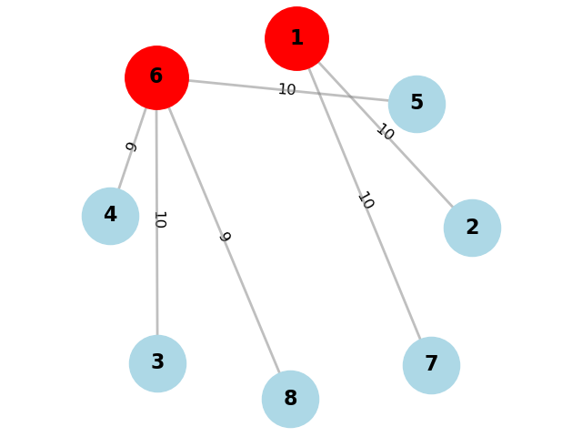

# 实验报告：市区公共救护中心选址优化

## 一、问题

某市由8个行政区组成,各区之间的救护车辆的行车时间(单位:min)如下表所示.市政府拟在市区内建立公共救护中心,设计要求从各区到救护中心的行车时间都不超过10min.该市政府请你提供可行的设计方案:全市至少要建几个救护中心,具体建在哪个区?

## 二、问题分析

该市由8个行政区组成，行车时间矩阵（单位：分钟）如下所示：

|       | A    | B    | C    | D    | E    | F    | G    | H    |
| ----- | ---- | ---- | ---- | ---- | ---- | ---- | ---- | ---- |
| **A** | 0    | 10   | 11   | 13   | 15   | 16   | 10   | 17   |
| **B** | 10   | 0    | 12   | 14   | 15   | 13   | 19   | 16   |
| **C** | 11   | 12   | 0    | 9    | 9    | 10   | 14   | 12   |
| **D** | 13   | 14   | 9    | 0    | 10   | 9    | 12   | 11   |
| **E** | 15   | 15   | 9    | 10   | 0    | 10   | 16   | 18   |
| **F** | 16   | 13   | 10   | 9    | 10   | 0    | 12   | 9    |
| **G** | 10   | 19   | 14   | 12   | 16   | 12   | 0    | 14   |
| **H** | 17   | 16   | 12   | 11   | 18   | 9    | 14   | 0    |

完成上面任务需要考虑2个问题

- 每个行政区至少有一个救护中心覆盖
- 且每个行政区到距离最近的救护中心不超过10分钟的行车时间

为了完成上面的任务，我们考虑一下方式

- 将时间矩阵$T_{ij}$转换成覆盖矩阵$D_{ij}$,即对于第i区域到达第j区域的时间如果大于10min，则$D_{ij}$=0,反之为1
- 此外，考虑构建一个01变量$X_{j}$,代表在第j区域建立救护站为1，不建立为0。
- 对于第i区域，为了确保至少存在一个救护站与其通行时间不超过10min，我们构建约束条件$\sum_{j =1}^{8} X_j × D_{ij} \ge  1$来确保上面的条件。这个约束条件的含义是对于在第i行政区，遍历所有的j行政区，$X_j D_{ij}$=1，则既在j区域构建救护中心，而且距离第i区域的时间小于10min。
- 这样构建约束条件既可以确保每一个行政区至少有一个救护站相连，也能确保与其相连的最短救护中心时间小于10min


## 三、模型建立

### 1. 目标

最小化建立的救护中心数量。

### 2. 变量定义

- $N$: 行政区域数量，这里是8个，记为$\{1, 2, 3, 4, 5, 6, 7, 8\}$。
- $X_i$: 表示是否在第$i$个行政区建立救护中心，若建立则为1，否则为0。
- $T_{ij}$: 表示从第$i$个行政区到第$j$个行政区的行车时间。
- $D_{ij}$: 表示第$i$个行政区是否被第$j$个行政区的救护中心覆盖，若覆盖则为1，否则为0。

### 3. 目标函数

$$\text{Minimize } \sum_{i=1}^{N} X_i$$

### 4.约束条件

每个行政区到最近的救护中心的行车时间都不超过10分钟,且至少存在一个与其相连：

$$\sum_{j=1}^{8} X_j \cdot D_{ij} \geq 1, \forall i \in \{1, 2, 3, 4, 5, 6, 7, 8\}$$

## 四、模型求解

### 1.Python代码求解

利用PuLP库进行求解的完整代码：

```python
import matplotlib.pyplot as plt
import networkx as nx
import numpy as np
from pulp import LpProblem, LpVariable, lpSum, LpMinimize, value

# 行政区域和行车时间数据
districts = ['1', '2', '3', '4', '5', '6', '7', '8']
drive_times = [
    [0, 10, 11, 13, 15, 16, 10, 17],
    [10, 0, 12, 14, 15, 13, 19, 16],
    [11, 12, 0, 9, 9, 10, 14, 12],
    [13, 14, 9, 0, 10, 9, 12, 11],
    [15, 15, 9, 10, 0, 10, 16, 18],
    [16, 13, 10, 9, 10, 0, 12, 9],
    [10, 19, 14, 12, 16, 12, 0, 14],
    [17, 16, 12, 11, 18, 9, 14, 0]
]

# 创建线性规划问题
prob = LpProblem("Ambulance_Center", LpMinimize)

# 创建变量，表示是否在每个区建立救护中心
centers = LpVariable.dicts("Center", districts, cat='Binary')

# 创建变量，表示每个区域被覆盖的情况
cover = LpVariable.dicts("Cover", (districts, districts), cat='Binary')

# 目标函数：最小化建立的救护中心数量
prob += lpSum([centers[i] for i in districts])

#将时间矩阵转换成覆盖矩阵
for i in range(len(districts)):
    for j in range(len(districts)):
        if drive_times[i][j] <= 10:
            cover[districts[i],districts[j]] = 1
        else:
            cover[districts[i],districts[j]] = 0

# 约束条件：每个区到最近的救护中心的行车时间都不超过10分钟且确保存在一个
for i in range(len(districts)):
    prob += lpSum([centers[districts[j]]*cover[districts[i],districts[j]]  for j in range(len(districts))]) >= 1

# 解决问题
prob.solve()

# 输出结果
print("建立的救护中心数量:", int(value(prob.objective)))
print("救护中心位置:")
center_nodes = []
for i in districts:
    if centers[i].varValue == 1:
        print("在区域", i)
        center_nodes.append(i)

#@@@@@@@@@@@@@@@@@@@@@@@@@@        
#上面已经完成求解，下面是可视化代码
#@@@@@@@@@@@@@@@@@@@@@@@@@@ 
# 找到每个区域最近的救护中心
closest_center = {}
for i in range(len(districts)):
    min_time = float('inf')
    for center in center_nodes:
        j = districts.index(center)
        if drive_times[i][j] < min_time:
            min_time = drive_times[i][j]
            closest_center[districts[i]] = center

# 绘制图
G = nx.Graph()

# 添加节点
for district in districts:
    G.add_node(district)

# 生成布局
pos = nx.spring_layout(G, seed=42)

# 绘制节点
nx.draw(G, pos, with_labels=True, node_color='lightblue', node_size=2000, font_size=16, font_weight='bold')

# 高亮救护中心
nx.draw_networkx_nodes(G, pos, nodelist=center_nodes, node_color='red', node_size=2500)

# 绘制10分钟为半径的圆
for center in center_nodes:
    circle = plt.Circle(pos[center], 0.1, color='red', fill=False, linestyle='--', linewidth=2)
    plt.gca().add_patch(circle)

# 添加每个区域到最近救护中心的边和标签
for district in districts:
    if district != closest_center[district]:
        G.add_edge(district, closest_center[district])
        edge_labels = {(district, closest_center[district]): drive_times[districts.index(district)][districts.index(closest_center[district])]}
        nx.draw_networkx_edge_labels(G, pos, edge_labels=edge_labels, font_size=12)
        
nx.draw_networkx_edges(G, pos, edgelist=G.edges, width=2, alpha=0.5, edge_color='gray')

plt.title('每一个区域到达最近救护中心的图 (线的长度用时间表示)')
plt.gca().set_aspect('equal', adjustable='box')
plt.show()


```

### 2.Lingo代码

直接根据第i区到第j区的时间，求得了覆盖矩阵，如下

```python
D[i][j]=[
     [1, 1, 0, 0, 0, 0, 1, 0],
     [1, 1, 0, 0, 0, 0, 0, 0],
     [0, 0, 1, 1, 1, 1, 0, 0],
     [0, 0, 1, 1, 1, 1, 0, 0],
     [0, 0, 1, 1, 1, 1, 0, 0],
     [0, 0, 1, 1, 1, 1, 0, 1],
     [1, 0, 0, 0, 0, 0, 1, 0],
     [0, 0, 0, 0, 0, 1, 0, 1]
]
```

然后带入$$\sum_{j=1}^{8} X_j \cdot D_{ij} \geq 1, \forall i \in \{1, 2, 3, 4, 5, 6, 7, 8\}$$，得到约束条件如下代码所示

```matlab
MODEL:

! 定义变量 ;
SETS:
    BINARY_VAR /X1, X2, X3, X4, X5, X6, X7, X8/;
ENDSETS

! 目标函数 ;
MIN = X1 + X2 + X3 + X4 + X5 + X6 + X7 + X8;

! 约束条件 ;
X1 * 1 + X2 * 1 + X3 * 0 + X4 * 0 + X5 * 0 + X6 * 0 + X7 * 1 + X8 * 0 >= 1;
X1 * 1 + X2 * 1 + X3 * 0 + X4 * 0 + X5 * 0 + X6 * 0 + X7 * 0 + X8 * 0 >= 1;
X1 * 0 + X2 * 0 + X3 * 1 + X4 * 1 + X5 * 1 + X6 * 1 + X7 * 0 + X8 * 0 >= 1;
X1 * 0 + X2 * 0 + X3 * 1 + X4 * 1 + X5 * 1 + X6 * 1 + X7 * 0 + X8 * 0 >= 1;
X1 * 0 + X2 * 0 + X3 * 1 + X4 * 1 + X5 * 1 + X6 * 1 + X7 * 0 + X8 * 0 >= 1;
X1 * 0 + X2 * 0 + X3 * 1 + X4 * 1 + X5 * 1 + X6 * 1 + X7 * 0 + X8 * 1 >= 1;
X1 * 1 + X2 * 0 + X3 * 0 + X4 * 0 + X5 * 0 + X6 * 0 + X7 * 1 + X8 * 0 >= 1;
X1 * 0 + X2 * 0 + X3 * 0 + X4 * 0 + X5 * 0 + X6 * 1 + X7 * 0 + X8 * 1 >= 1;

END
```


## 五、结果与讨论

### Python结果：

运行上述代码，得到如下结果：


可视化图如下

​                                             
个救护中心，分别在1和6

### Lingo结果


由图可知，$X_1=1,X_6=1$

## 六、结论

综上可知建立**两个**救护中心，分别在**区域1和区域6**就可以实现任务要求
